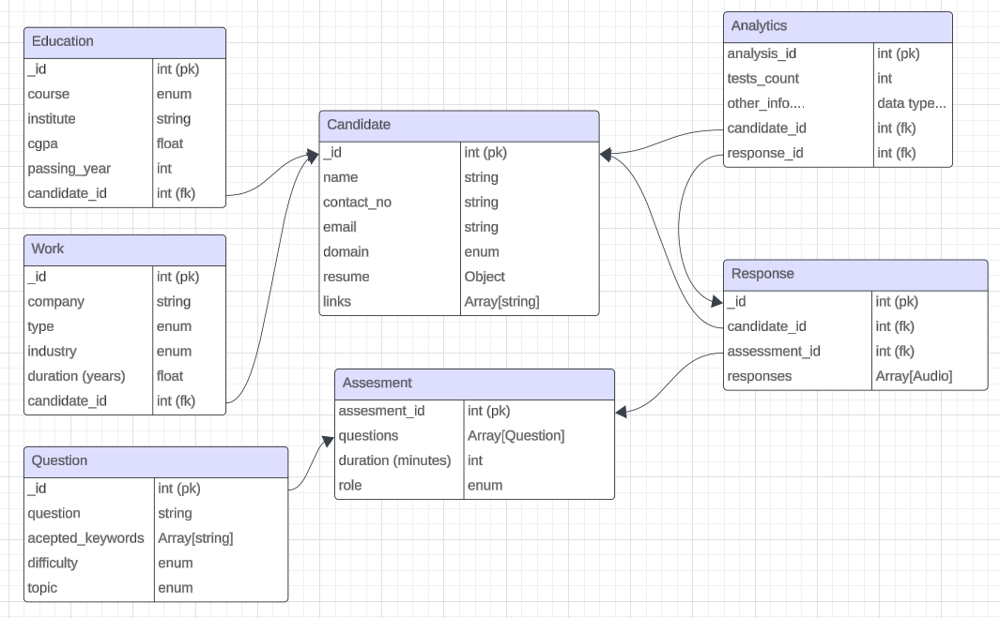

# Assessment API
### Developed using Express and MongoDB

### To run this locally
```
git clone https://github.com/harshpx/assessment-api.git
cd assessment-api
npm i

## now create a .env file using same attributes like .env_sample
## get your mongoDB atlas cluster url and insert it after 'MONGO_URI=' in .env
## set your desired port

##run the server by:
## 1. production (without nodemon)
npm start

## 2. development (with nodemon)
npm run dev
```

### API endpoints (till now):
1. For candidates
    * GET: /api/candidates : to fetch all candidates
    * POST: /api/candidates : to create a candidate
    * PUT: /api/candidates/:id : to update an existing candidate
    * DELETE: /api/candidates/:id : to delete an existing candidate

2. For questions:
    * GET: /api/questions
    * POST: /api/questions
    * DELETE: /api/questions/:id

3. For assessments:
    * GET: /api/assessments
    * POST: /api/assessments


### ER diagram (Schema representation):
